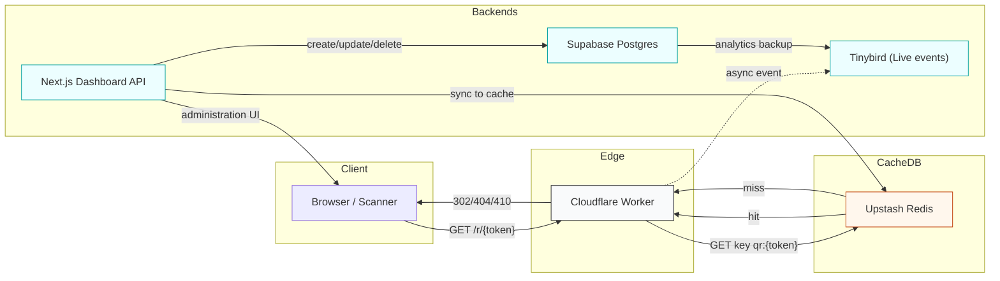
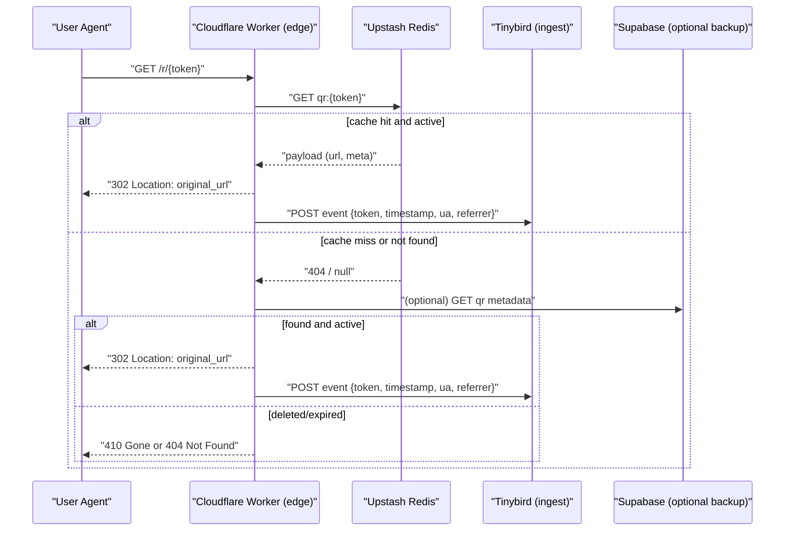
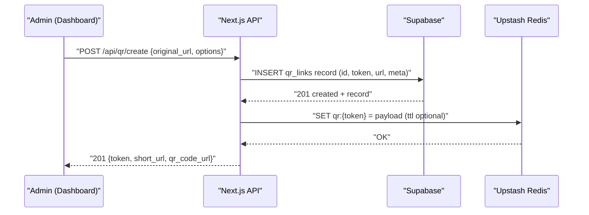

# System Architecture

## Overview

This document describes the high-level architecture for the QR-Code-Generator prototype. It covers the main components, data flows, and operational considerations. The system is designed for low-latency redirect handling at the edge, a management dashboard for CRUD operations, and an analytics ingestion pipeline for scan events.

- Browser / Mobile clients: create and scan QR codes; scan requests hit the redirect endpoint.
- Cloudflare Worker: edge redirect engine — reads fast cache (Upstash Redis) and issues 302/404/410 responses. It sends async analytics events to Tinybird.
- Next.js Dashboard (App Router, TypeScript): management APIs for creating/updating/deleting QR links, serving QR image generation, and an admin UI.
- Supabase (Postgres): canonical storage for QR metadata (`qr_links`) and `scan_events` backup.
- Upstash Redis (REST): lightweight fast read cache used by the Worker to serve redirects with low latency.
- Tinybird: real-time analytics ingestion (Live events) for scan events and fast analytics queries.

Design goals:

- Redirects must be served with minimal latency (edge-first via Cloudflare Workers).
- CRUD operations and analytics ingestion must be durable and auditable (Supabase as source-of-truth).
- Analytics should be fast to query and optimized for time-series (Tinybird event ingestion).
- Local dev-friendly with in-memory fallbacks for Upstash/Supabase for quick verification.

## Component Diagram

## Sequence Diagrams

### Redirect flow (scan)

### Create QR (admin) flow

## Operational Notes

- Compatibility: keep `wrangler` and `workerd` versions aligned with `compatibility_date` in `worker/wrangler.toml`.
- Secrets: store `TINYBIRD_API_KEY` and `UPSTASH_REDIS_REST_TOKEN` as secrets (wrangler secrets / deployment env).
- Local dev: use `dashboard/.env.local` with `USE_IN_MEMORY_STORE=true` to avoid external dependencies.
- Analytics: Tinybird ingest is non-blocking; consider batch sampling or downstream ETL for long-term storage.

## References

- [SETUP.md](SETUP.md) — environment and onboarding steps
- [schema.sql](schema.sql) — Supabase schema for `qr_links` and `scan_events`
- `worker/` — Cloudflare Worker edge redirect logic
- `dashboard/` — Next.js dashboard + API routes

---

Document generated by the development assistant. Update as architecture evolves.
